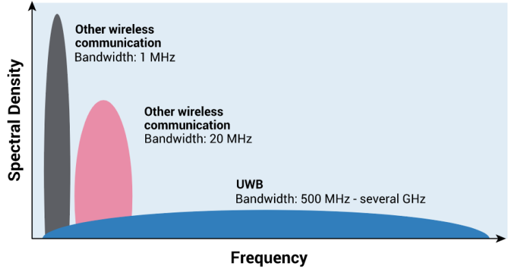
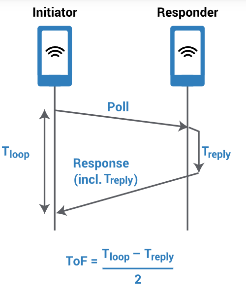
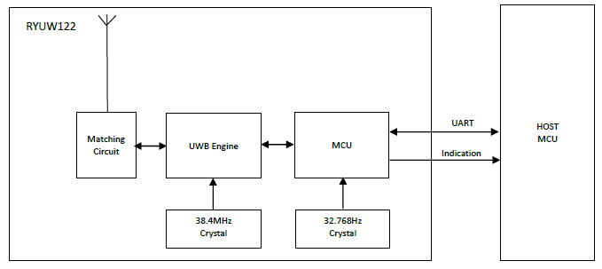
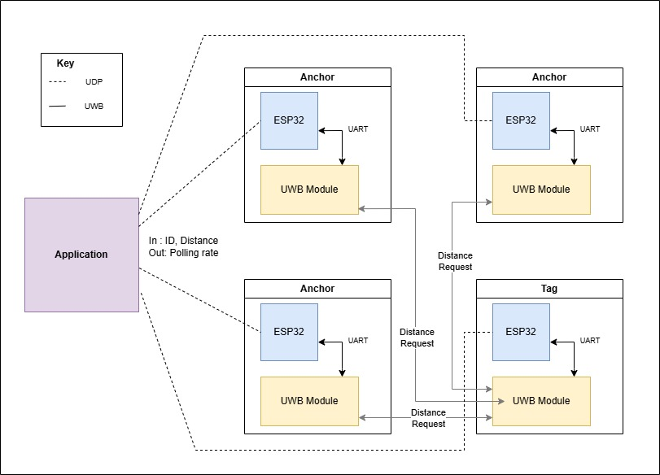
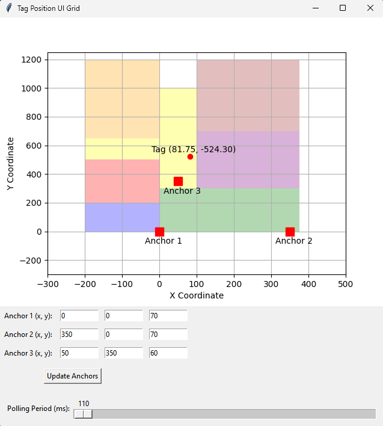

# Ultra-Wideband-Positioning
Using UWB modules and ESP32s this project allows for accurate indoor/small outdoor position tracking

### What is Ultra-Wideband?
  
Ultra-Wideband (UWB) is a wireless communication technology characterized by its ability to transmit data over a wide frequency spectrum, typically exceeding 500 MHz. This enables UWB to achieve high data rates while consuming low power, making it suitable for short-range applications such as precise location tracking and secure communications. UWB operates by sending very short radio pulses, allowing devices to measure the Time-of-Flight (ToF) of these signals, which results in accurate distance measurements—often within centimeters. Its advantages over traditional technologies like Bluetooth and Wi-Fi include greater accuracy and reduced interference, positioning UWB as a key player in modern applications ranging from smart devices to industrial automation.

### Time of Flight
  
A Ultra-Wideband (UWB) device, often referred to as a tag, communicates by sending out a signal. A receiver, commonly called an anchor, captures this signal. The Time of Flight (ToF) is a key metric in UWB positioning and is calculated by measuring the time difference between when the signal is sent by the tag and when it is received by the anchor.
To ensure accuracy, the measured time is divided by two. This adjustment accounts for the round trip of the signal — from the tag to the anchor and back. Once the ToF is calculated, the distance between the tag and the anchor can be determined by multiplying the ToF by the speed of light.

---
### Device Used : [Reyax-RYUW122](https://reyax.com/products/RYUW122)

### Network Diagram
  
Here we can see how the UWB modules communicate with eachother. The anchors send messages addressed to the tag which are then used to calculate distance between each anchor and the tag respectively. Each ESP32 is responsible for initializing its UWB module, requesting tag location at a polling rate which can be changed from the client application, and sending the distance back to the client. 

### UI Example
  
Here is an example of the UI which is mapped to the measurements of my apartment. Different rooms/sections are specified by color.
